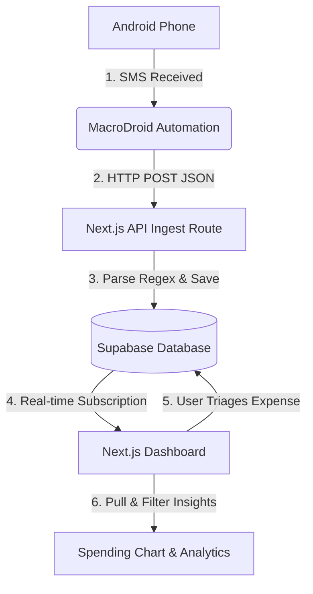

# 🛠️ How it Works Under the Hood

This document provides a detailed technical breakdown of the **Cashew Clone** architecture, detailing how transaction SMS alerts are captured, parsed, stored in real-time, triaged, and visualized.

---

## 🏗️ System Architecture Overview

The application is built on a modern, reactive stack composed of four main layers:



---

## 📱 Step 1: Automated SMS Collection (Android Device)

The ingestion pipeline begins directly on your Android device.

1. **Trigger**: **MacroDroid** monitors incoming SMS notifications.
   - It filters messages from specific sender addresses (e.g. bank handles like `AD-ICICIB`, `HDFCBK`) or checks message content against wildcards such as `*Rs*` or `*INR*`.
2. **Action**: Once triggered, MacroDroid executes an asynchronous **HTTP POST** request:
   - **URL**: `https://your-deployed-app-url.vercel.app/api/ingest`
   - **Content Type**: `application/json`
   - **Payload**:
     ```json
     {
       "raw_message": "[sms_message]"
     }
     ```
     *(The token `[sms_message]` is replaced by the actual body text of the SMS).*

---

## 📥 Step 2: The Ingestion & Parsing Engine

The endpoint [`app/api/ingest/route.ts`](file:///c:/Users/fawaz/cashew-clone/app/api/ingest/route.ts) parses incoming text in real-time using regular expressions:

### 1. Amount Extraction
To extract transaction value in Rupees (INR), the parser executes:
```typescript
const amountMatch = rawMessage.match(/(?:Rs\.?|INR)\s*(\d+(?:\.\d{1,2})?)/i);
```
It looks for prefix patterns like `Rs.`, `Rs`, or `INR`, followed by integer or decimal values.

### 2. Transaction Type Detection
The system determines whether the SMS represents income (a credit alert) or an expense:
```typescript
const isIncome = /is credited with/i.test(cleanedMessage) || /credited to/i.test(cleanedMessage);
const transactionType = isIncome ? 'income' : 'expense';
const initialCategory = isIncome ? 'Income' : 'Uncategorized';
```

### 3. Merchant Name Extraction
The parser cleans boilerplate text (such as dispute support numbers or block messages) and applies regex rules to match different bank notification formats:
* **Format A (Direct Credits)**: Matches `; [Merchant] credited.`
  ```typescript
  /;\s*(.+?)\s+credited/i
  ```
* **Format B (UPI info strings)**: Matches `Info: UPI/[Ref]/[Merchant]`
  ```typescript
  /Info:\s*UPI\/\d+\/(.+?)(?:\.|$|\s)/i
  ```
* **Format C (Standard UPI debits)**: Matches `paid to [Merchant]`, `sent to [Merchant]`, or `to [Merchant]`
  ```typescript
  /(?:sent to|paid to|to|VPA)\s+(.+?)(?:\s+on|\s+via|\s+Ref|\s+UPI|\.|$)/i
  ```
* **Format D (Incoming transfers)**: Matches `from [Sender]`
  ```typescript
  /from\s+(.+?)(?:\.|\s+UPI|$)/i
  ```

### 4. Date Normalization & Date-Time Stitching
To solve the "Slow SMS" latency issue (where an SMS received late at night or the next day gets logged with the wrong date), the parser extracts the calendar date from the message (e.g. `on 14-Jun-26`):
```typescript
const dateMatch = rawMessage.match(/on\s+(\d{1,2}-[a-zA-Z]{3}-\d{2})/i);
```
* If a date is found:
  1. The string is parsed (e.g. `14 Jun 2026`).
  2. The calendar date of the database record is updated to match.
  3. **Crucially**, the current hour, minute, and second are preserved. This prevents all transactions from defaulting to midnight (`00:00:00`), keeping the transaction order intuitive.

---

## ⚡ Step 3: Real-Time Inboxes & Triage

The user classifies and triages incoming alerts in [`app/page.tsx`](file:///c:/Users/fawaz/cashew-clone/app/page.tsx):

1. **Initial Load**: The dashboard fetches all items with `category = 'Uncategorized'` ordered by date.
2. **Supabase Realtime Channel**:
   ```typescript
   const channel = getSupabase()
     .channel("realtime-expenses")
     .on(
       "postgres_changes",
       { event: "INSERT", schema: "public", table: "expenses" },
       (payload) => {
         const newExpense = payload.new as Expense;
         setExpenses((current) => [newExpense, ...current]);
       }
     )
     .subscribe();
   ```
   Whenever a new transaction SMS is processed by the API route and inserted into the Supabase database, it is pushed over WebSockets and instantly pops to the top of the triage list on screen without page reloads.
3. **Categorization**: 
   - Clicking a category quick-chip opens a modal.
   - The user can rename/clean up the merchant name.
   - For **Custom Categories** (like *Vacation* or *Gifts*), the user inputs their preferred custom category name. The app saves this directly to the database.

---

## 📊 Step 4: Insights & Visualization Engine

Once categorized, expenses are tracked in the interactive charts defined in [`app/components/SpendingChart.tsx`](file:///c:/Users/fawaz/cashew-clone/app/components/SpendingChart.tsx):

### 1. Date Range Filtering
The frontend filters transactions client-side using `date-fns`:
* **This Month**: From `startOfMonth(now)` to `endOfMonth(now)`.
* **Last Month**: From `startOfMonth(subMonths(now, 1))` to `endOfMonth(subMonths(now, 1))`.
* **All Time**: Displays all transactions.

### 2. Custom Category Grouping
To avoid cluttering the charts with dozens of unique custom category names, the chart engine dynamically groups them:
* Any expense category that doesn't match the preconfigured standard categories (`Food`, `Groceries`, `Transport`, `Shopping`, `Health`, `Fun`, `Bills`) is automatically grouped into a single **"Custom"** slice/bar in the chart.
* When viewing transactions inside the custom slice, the category name is prepended directly (e.g., `Gifts • 14 Jun`) so you can identify the exact subcategory.

### 3. Custom SVG Donut & Bar Charts
* **Donut Chart**: Uses trigonometry (`cos`, `sin`) to render precise donut segments and floating category icons at their center points. Clicking a slice pops it outward (`POP = 9px`) using SVG transforms and displays a breakdown of transactions.
* **Bar Chart**: Renders responsive bars scaled proportionally to the highest spending category.
